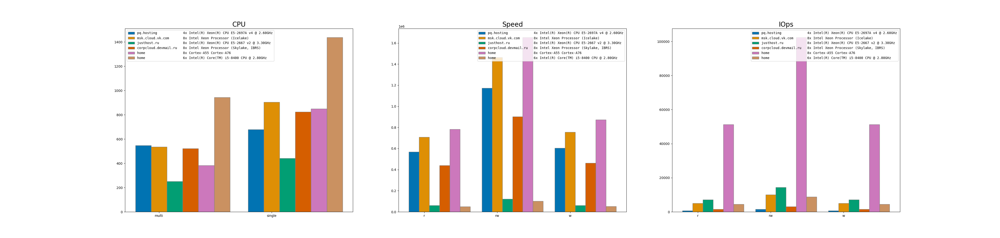

I've tested all my VPS and servers to understand what I should do to build const-effective lab for my projects

| Provider            | CPU                                              | Disk | Real config |
|---------------------|--------------------------------------------------|--------------------|----------------|
| pq.hosting          | 4x Intel(R) Xeon(R) CPU E5-2697A v4 @ 2.60GHz  | SSD NVME | Unknown |
| msk.cloud.vk.com    | 8x Intel Xeon Processor (Icelake)               | High-IOPS SSD | Unknown |
| justhost.ru         | 8x Intel(R) Xeon(R) CPU E5-2667 v2 @ 3.30GHz   | nvme | Unknown |
| corpcloud.devmail.ru| 8x Intel Xeon Processor (Skylake, IBRS)        | SSD | Unknown |
| home               | 8x Cortex-A55 Cortex-A76                       | [Chineese M.2 NMVe 2280 PCIe 3.0](https://aliexpress.ru/item/32847169083.html) | [Orange Pi 5 Plus](https://aliexpress.ru/item/1005005562033311.html) |
| home               | 6x Intel(R) Core(TM) i5-8400 CPU @ 2.80GHz     | mdadm raid 1 of 2x120Gb SSD Silicon Power V60 | mb: ASRock Z370M-ITX/ac, cpu: i5-8400 |

I have written down everything I know. Of course, it is not a comprehensive test with all possible variations, but in my case, it is sufficient to create the most budget-friendly lab.

